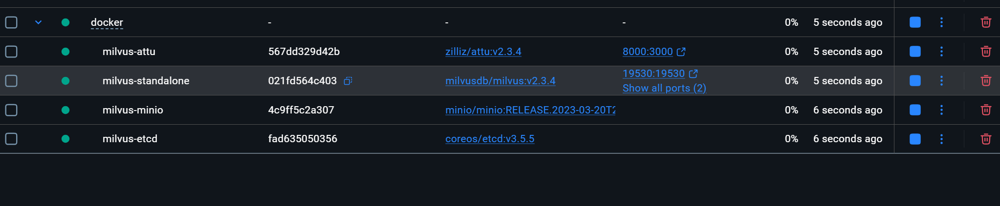
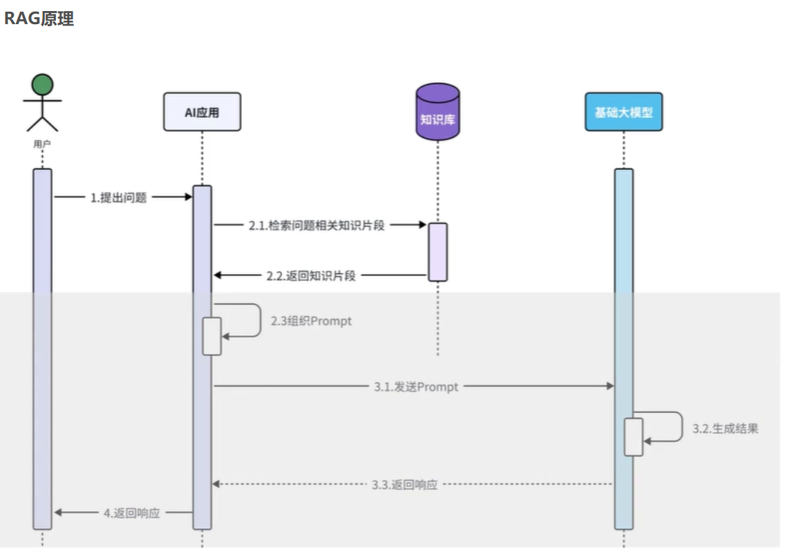
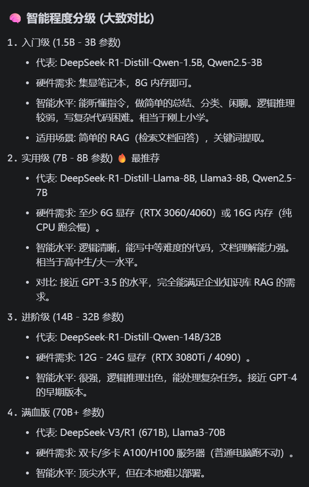

# 知识库应用场景与实战攻略

## 💡 知识库能做哪些事情？

1.  **搜索与推荐**: 把用户浏览记录转为向量，匹配相似商品
2.  **智能客服**: 将用户问题映射到知识库答案的向量空间
3.  **人脸识别**: 将人脸图像编码为 128 维向量 (如 FaceNet+)
4.  **病历分析**: 医疗文本 Embedding 辅助诊断 (如腾讯觅影+)
5.  **合同审查**: 法律条文 Embedding 快速匹配相似案例
6.  **以图搜图**: 图片 Embedding 相似度匹配 (电商找同款)
7.  **信贷评估**: 将消费记录转为信用风险向量

---

## 🛠️ 项目实战步骤

### 1. 安装 Milvus 向量数据库

#### 1.1 准备环境
确保已安装 Docker。

#### 1.2 启动服务
在 `SU_KBS/docker` 目录下运行：
```bash
docker compose up -d
```
该命令将启动以下服务：
*   **Milvus Standalone** (主服务)：端口 `19530`
*   **Etcd** (元数据存储)
*   **MinIO** (对象存储)
*   **Attu** (可视化管理工具)：端口 `8000`

#### 1.3 验证
Docker 容器启动后，即可通过浏览器访问 Attu。


### 2. 初始化项目

*   **引入依赖**: 引入 `langchain4j-milvus`。
*   **配置连接**: 在 `application.yml` 中配置 Milvus 地址。
*   **实现 Embedding 流程**: 使用 LangChain4j 的 `MilvusEmbeddingStore` 类，封装繁琐的 SDK 调用。
*   **测试**: 存入一条 "Hello World"，在 Attu 中查看是否新增数据。

**RAG 知识库逻辑架构**:


### 3. 业务场景深入：搜索与推荐

**目标**: 把用户浏览记录转为向量，匹配相似商品。可参考《2024-员工手册》数据进行测试。

#### 3.1 数据分组策略
*   **商品数据**: 独立存储。
*   **用户行为**: 独立存储。

#### 3.2 存储核心规范
> **⚠️ 重点**: 商品和用户行为兴趣记录**不要**存到一个 Collection 中。

*   **避免噪音**: 否则查商品 A 时，可能会查出“张三在周四看了商品 A”这种无关记录。
*   **推荐逻辑**:
    1.  从 **Collection B (用户库)** 中查出用户 `user_888` 的兴趣向量。
    2.  拿着这个“用户兴趣向量”，去 **Collection A (商品库)** 做相似度搜索 (`search`)。
    3.  Milvus 返回与该用户兴趣最接近的 Top 10 商品。

#### 3.3 其他注意事项
*   **会话持久化**: 考虑如何优雅地存储和分组会话数据。
*   **重复命中**: 避免重复查询消耗 LLM Token，注意查看账单。
---

## ❓ AI 常见问题与解决方案

### 1. 本地部署 Ollama (免费 Token 方案)



**Ollama** 是目前最简单、最稳定的本地大模型运行工具。

#### 第一步：下载并安装
*   **下载地址**: [https://ollama.com/download/windows](https://ollama.com/download/windows)
*   **操作步骤**:
    1.  点击 Download 下载 `.exe` 安装包。
    2.  双击运行，一路 Next 安装（默认 C 盘，模型也存 C 盘，请预留 20G+ 空间）。
    3.  安装完成后，打开 PowerShell 或 CMD。

#### 第二步：拉取并运行模型 (8B)
在终端执行以下命令拉取模型：

*   **推荐模型**: `deepseek-r1:8b` (即 DeepSeek-R1-Distill-Llama-8B)
*   **备选方案**:
    *   显存较小 (<6G): `deepseek-r1:1.5b`
    *   Llama 系列: `llama3`

```powershell
ollama run deepseek-r1:8b
```

#### 第三步：验证 API 服务
Ollama 启动后默认监听 `11434` 端口。
访问 [http://localhost:11434](http://localhost:11434)，如果看到 `Ollama is running` 说明服务正常。

#### 第四步：修改 Spring Boot 配置
修改 `application.yml`，让 LangChain4j 连接本地 Ollama。
